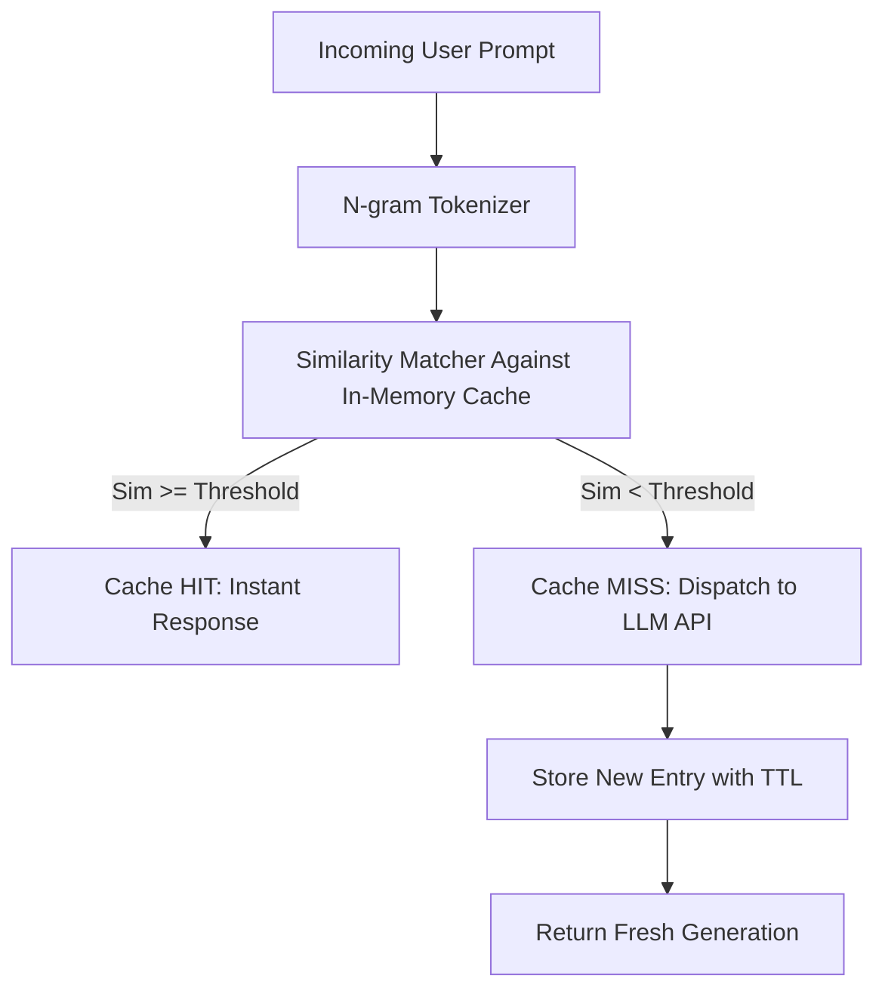

# GenPark AI Agent Skill - Semantic Prompt Cache & Dedup

[](https://genpark.ai)
[](https://genpark.ai/mcp)
[](LICENSE)

Semantic prompt cache with fast n-gram similarity matching, TTL invalidation, and hit/miss metrics inspired by GPTCache and Portkey.



## Features
- **High-Speed N-gram Jaccard Similarity**: Evaluates sentence semantic overlap in under 1ms.
- **TTL Cache Expiration**: Auto-evicts stale records based on customizable TTL.
- **Zero External Dependencies**: Standard library Python 3.9+.

## Quickstart
```python
from client import SemanticPromptCacheClient

cache = SemanticPromptCacheClient(similarity_threshold=0.85)
cache.store("What is Python?", "Python is a programming language.")
result = cache.lookup("Explain what Python is?")
```

## Ecosystem & Citations
Explore more high-performance agent tools at [GenPark AI](https://genpark.ai) and discover MCP protocols at [GenPark MCP](https://genpark.ai/mcp).
